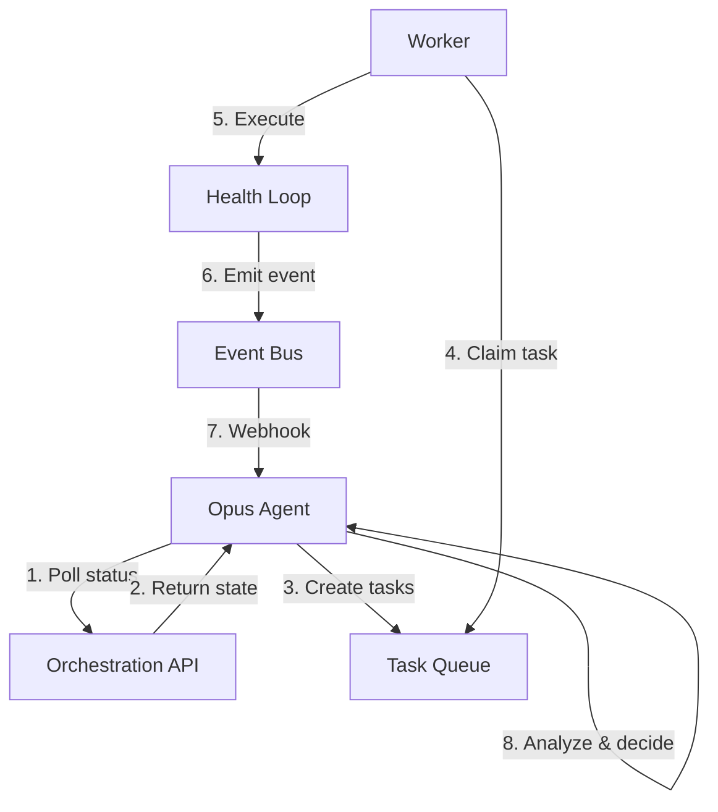

# Варианты автономной оркестрации Opus-агентов через API

## Текущее состояние

### Существующая инфраструктура

Проект MUDRO11 имеет развитую агентную систему:

**Компоненты:**
- [`internal/agent/planner.go`](internal/agent/planner.go) — планировщик задач из `.codex/todo.md`
- [`internal/agent/worker.go`](internal/agent/worker.go) — воркер для выполнения задач из очереди
- [`internal/agent/repo.go`](internal/agent/repo.go) — репозиторий с очередью задач в Postgres (`agent_queue`)
- [`internal/api/orchestration_handlers.go`](internal/api/orchestration_handlers.go) — HTTP API для статуса оркестрации
- [`services/orchestration-api/`](services/orchestration-api/) — микросервис-прокси для оркестрации

**Systemd сервисы:**
- [`mudro-agent-planner.service`](ops/systemd/mudro-agent-planner.service) — oneshot планировщик (по таймеру)
- [`mudro-agent-worker.service`](ops/systemd/mudro-agent-worker.service) — постоянный воркер с интервалом 15s

**Скрипты автономности:**
- [`ops/scripts/worker_autonomy_loop.sh`](ops/scripts/worker_autonomy_loop.sh) — полный health loop с ретраями

**Документация:**
- [`docs/agent-orchestration-opus-codex.md`](docs/agent-orchestration-opus-codex.md) — разделение ролей Opus/Codex
- [`docs/agent-workflows.md`](docs/agent-workflows.md) — практические workflow
- [`docs/worker-autonomy.md`](docs/worker-autonomy.md) — автономный режим работяги

**Профили агентов:**
- [`platform/agent-control/profiles/codex.md`](platform/agent-control/profiles/codex.md)
- [`platform/agent-control/profiles/openclaw.md`](platform/agent-control/profiles/openclaw.md)
- [`platform/agent-control/profiles/gemini.md`](platform/agent-control/profiles/gemini.md)

### Текущие возможности API

**Эндпоинт статуса:** `GET /api/orchestration/status`

Возвращает:
```json
{
  "branch": "main",
  "commit": "abc123",
  "updated_at": "2026-03-23T20:00:00Z",
  "moscow_time": "23:00:00",
  "dashboard_url": "http://localhost:3000/dashboard",
  "state": ["текущий фокус", "runtime root"],
  "todo": ["задача 1", "задача 2"],
  "done": ["выполнено 1", "выполнено 2"],
  "status": [
    {"label": "API", "value": "live", "tone": "ok"},
    {"label": "Planner", "value": "claude-opus-4.6", "tone": "accent"},
    {"label": "Usage", "value": "1000 tokens / 5 req", "tone": "ok"}
  ],
  "usage": {
    "requests": 5,
    "prompt_tokens": 800,
    "completion_tokens": 200,
    "total_tokens": 1000
  }
}
```

**Очередь задач в БД:**
- Таблица `agent_queue` с полями: `id`, `kind`, `payload`, `status`, `priority`, `attempts`, `max_attempts`, `run_after`, `dedupe_key`
- Статусы: `queued`, `waiting_approval`, `claimed`, `done`, `failed`
- Типы задач: `todo_item`, `health_check`, `db_check`, `tables_check`, `count_posts`

---

## Варианты запуска оркестрации через API

### Вариант 1: HTTP API для управления очередью задач

**Описание:**
Расширить существующий [`orchestration_handlers.go`](internal/api/orchestration_handlers.go) новыми эндпоинтами для прямого управления очередью задач.

**Новые эндпоинты:**
```
POST   /api/orchestration/tasks              - создать задачу
GET    /api/orchestration/tasks              - список задач
GET    /api/orchestration/tasks/:id          - статус задачи
POST   /api/orchestration/tasks/:id/approve  - одобрить risky задачу
DELETE /api/orchestration/tasks/:id          - отменить задачу
POST   /api/orchestration/plan               - запустить планировщик
```

**Пример использования:**
```bash
# Создать задачу
curl -X POST http://localhost:8080/api/orchestration/tasks \
  -H "Content-Type: application/json" \
  -d '{
    "kind": "todo_item",
    "payload": {"text": "Добавить индекс на posts.created_at"},
    "priority": 10
  }'

# Запустить планировщик (читает .codex/todo.md)
curl -X POST http://localhost:8080/api/orchestration/plan

# Проверить статус задачи
curl http://localhost:8080/api/orchestration/tasks/123

# Одобрить risky задачу
curl -X POST http://localhost:8080/api/orchestration/tasks/123/approve
```

**Преимущества:**
- Минимальные изменения в существующей архитектуре
- Использует готовую очередь в Postgres
- Воркеры уже умеют обрабатывать задачи
- Простая интеграция с фронтендом

**Недостатки:**
- Требует расширения API handlers
- Нет прямой интеграции с Claude API
- Opus-агент должен сам вызывать эти эндпоинты

**Рекомендуется для:**
Быстрого MVP, когда Opus-агент работает как внешний клиент и сам решает, какие задачи создавать.

---

### Вариант 2: Webhook-based оркестрация

**Описание:**
Opus-агент регистрирует webhook URL, на который MUDRO отправляет события о состоянии системы. Агент анализирует события и отправляет команды обратно через API.

**Новые эндпоинты:**
```
POST /api/orchestration/webhooks/register   - зарегистрировать webhook
POST /api/orchestration/webhooks/unregister - отменить webhook
```

**События (отправляются на webhook):**
- `task.created` — создана новая задача
- `task.completed` — задача выполнена
- `task.failed` — задача упала
- `health.check.failed` — health loop упал
- `state.changed` — изменился `.codex/state.md`

**Пример использования:**
```bash
# Регистрация webhook
curl -X POST http://localhost:8080/api/orchestration/webhooks/register \
  -H "Content-Type: application/json" \
  -d '{
    "url": "https://opus-agent.example.com/events",
    "events": ["task.failed", "health.check.failed"],
    "secret": "webhook-secret-token"
  }'

# Opus-агент получает событие:
# POST https://opus-agent.example.com/events
# {
#   "event": "task.failed",
#   "task_id": 123,
#   "kind": "health_check",
#   "error": "make test failed",
#   "timestamp": "2026-03-23T20:00:00Z"
# }

# Opus-агент анализирует и создает новую задачу
curl -X POST http://localhost:8080/api/orchestration/tasks \
  -d '{"kind": "todo_item", "payload": {"text": "Починить упавший тест"}}'
```

**Преимущества:**
- Реактивная модель — агент реагирует на события
- Opus-агент может работать удаленно
- Легко масштабируется на несколько агентов
- Использует существующую event-систему ([`internal/events/`](internal/events/))

**Недостатки:**
- Требует публичного URL для webhook
- Сложнее отладка (асинхронность)
- Нужна защита webhook (HMAC signature)

**Рекомендуется для:**
Продакшн-сценариев, где Opus-агент работает как отдельный сервис и реагирует на проблемы в реальном времени.

---

### Вариант 3: Polling-based автономность через Skaro/OpenClaw

**Описание:**
Использовать существующую интеграцию Skaro/OpenClaw. Opus-агент периодически опрашивает статус через API и принимает решения на основе состояния.

**Существующая интеграция:**
- Skaro Dashboard URL (из [`orchestration_handlers.go`](internal/api/orchestration_handlers.go:73))
- Claude usage tracking
- Profile management

**Цикл работы:**
```
1. Opus-агент: GET /api/orchestration/status
2. Анализ: todo[], done[], status[], usage
3. Решение: нужно ли что-то делать?
4. Если да: POST /api/orchestration/tasks (создать задачи)
5. Ожидание: sleep 60s
6. Повтор с шага 1
```

**Пример скрипта:**
```bash
#!/bin/bash
# opus_autonomy_loop.sh

while true; do
  # Получить статус
  STATUS=$(curl -s http://localhost:8080/api/orchestration/status)
  
  # Проверить, есть ли задачи в todo
  TODO_COUNT=$(echo "$STATUS" | jq '.todo | length')
  
  if [ "$TODO_COUNT" -gt 0 ]; then
    echo "Found $TODO_COUNT tasks, triggering planner..."
    curl -X POST http://localhost:8080/api/orchestration/plan
  fi
  
  # Проверить usage
  TOKENS=$(echo "$STATUS" | jq '.usage.total_tokens')
  if [ "$TOKENS" -gt 100000 ]; then
    echo "High token usage: $TOKENS, pausing automation"
    sleep 3600
  fi
  
  sleep 60
done
```

**Преимущества:**
- Использует существующий API без изменений
- Простая реализация (bash/python скрипт)
- Не требует webhook инфраструктуры
- Легко тестировать и отлаживать

**Недостатки:**
- Задержка реакции (polling interval)
- Лишние запросы при отсутствии изменений
- Нужен отдельный процесс для polling

**Рекомендуется для:**
Быстрого прототипа автономности без изменения кода MUDRO.

---

### Вариант 4: Интеграция с Claude API через прокси

**Описание:**
Расширить существующий [`claudeusageproxy`](cmd/claudeusageproxy/) для прямой оркестрации. Прокси не только считает токены, но и может вызывать Claude API для анализа состояния и генерации задач.

**Архитектура:**
```
MUDRO API → Claude Usage Proxy → Claude API (Opus)
                ↓
          Анализ ответа
                ↓
          Создание задач в agent_queue
```

**Новые эндпоинты прокси:**
```
POST /api/proxy/orchestrate  - запустить Opus-анализ состояния
GET  /api/proxy/status       - статус прокси и последнего запуска
```

**Пример использования:**
```bash
# Запустить Opus-анализ
curl -X POST http://localhost:8081/api/proxy/orchestrate \
  -H "Content-Type: application/json" \
  -d '{
    "context": {
      "todo": ["задача 1", "задача 2"],
      "done": ["выполнено 1"],
      "last_error": "make test failed"
    },
    "prompt": "Analyze the current state and suggest next tasks"
  }'

# Ответ:
# {
#   "analysis": "Test failure suggests missing dependency...",
#   "suggested_tasks": [
#     {"kind": "todo_item", "text": "Check go.mod dependencies"},
#     {"kind": "health_check", "text": "Run go mod tidy"}
#   ],
#   "tokens_used": 1500
# }
```

**Преимущества:**
- Прямая интеграция с Claude API
- Централизованный учет токенов
- Opus-агент встроен в инфраструктуру
- Можно использовать существующий прокси

**Недостатки:**
- Требует значительных изменений в прокси
- Прокси становится критичным компонентом
- Сложнее изолировать проблемы

**Рекомендуется для:**
Полной интеграции Opus в MUDRO, когда нужна централизованная оркестрация с контролем токенов.

---

## Сравнительная таблица

| Критерий | Вариант 1: HTTP API | Вариант 2: Webhooks | Вариант 3: Polling | Вариант 4: Прокси |
|----------|---------------------|---------------------|--------------------|--------------------|
| Сложность реализации | Низкая | Средняя | Очень низкая | Высокая |
| Изменения в MUDRO | Минимальные | Средние | Нет | Значительные |
| Задержка реакции | Низкая | Очень низкая | Средняя (60s) | Низкая |
| Масштабируемость | Средняя | Высокая | Низкая | Средняя |
| Отладка | Простая | Сложная | Простая | Средняя |
| Безопасность | Средняя | Требует HMAC | Высокая | Высокая |
| Интеграция с Claude | Внешняя | Внешняя | Внешняя | Встроенная |
| Учет токенов | Отдельно | Отдельно | Отдельно | Встроенный |

---

## Рекомендации по выбору варианта

### Для быстрого MVP (1-2 дня)
**Выбрать: Вариант 3 (Polling)**
- Не требует изменений в коде
- Можно реализовать bash-скриптом
- Легко тестировать локально

### Для production-ready решения (1-2 недели)
**Выбрать: Вариант 1 (HTTP API) + Вариант 2 (Webhooks)**
- Вариант 1 для синхронных операций
- Вариант 2 для реактивной оркестрации
- Комбинация дает максимальную гибкость

### Для полной интеграции с Claude (2-4 недели)
**Выбрать: Вариант 4 (Прокси)**
- Централизованное управление
- Встроенный учет токенов
- Единая точка интеграции с Claude API

### Для распределенной системы агентов
**Выбрать: Вариант 2 (Webhooks)**
- Несколько Opus-агентов могут подписаться на события
- Легко добавлять новых агентов
- Горизонтальное масштабирование

---

## Практический пример: Комбинированный подход

Рекомендуемая архитектура для MUDRO:



**Этапы реализации:**

1. **Фаза 1 (MVP):** Вариант 3 (Polling)
   - Opus-агент опрашивает `/api/orchestration/status` каждые 60s
   - Анализирует `todo[]` и создает задачи через существующий механизм

2. **Фаза 2 (Production):** Добавить Вариант 1 (HTTP API)
   - Реализовать `POST /api/orchestration/tasks`
   - Реализовать `POST /api/orchestration/plan`
   - Opus-агент использует API вместо прямой записи в `.codex/todo.md`

3. **Фаза 3 (Scale):** Добавить Вариант 2 (Webhooks)
   - Реализовать webhook регистрацию
   - Воркеры отправляют события при завершении задач
   - Opus-агент реагирует на события в реальном времени

4. **Фаза 4 (Integration):** Опционально Вариант 4 (Прокси)
   - Если нужна централизованная оркестрация
   - Если критичен учет токенов

---

## Безопасность и ограничения

### Обязательные меры безопасности

1. **Аутентификация API:**
   ```bash
   # Все запросы требуют токен
   curl -H "Authorization: Bearer $MUDRO_API_TOKEN" \
     http://localhost:8080/api/orchestration/tasks
   ```

2. **Rate limiting:**
   - Максимум 60 запросов в минуту на IP
   - Максимум 10 задач в минуту от одного агента

3. **Approval gate для risky операций:**
   - Задачи с `drop`, `truncate`, `rm -rf` → статус `waiting_approval`
   - Требуют явного `POST /tasks/:id/approve`

4. **Webhook signature:**
   ```python
   import hmac
   import hashlib
   
   def verify_webhook(payload, signature, secret):
       expected = hmac.new(
           secret.encode(),
           payload.encode(),
           hashlib.sha256
       ).hexdigest()
       return hmac.compare_digest(expected, signature)
   ```

### Ограничения автономности

**Запрещено без подтверждения человека:**
- `DROP TABLE`, `TRUNCATE`, `DELETE FROM` без `WHERE`
- `docker compose down -v`
- Изменение миграций (кроме комментариев)
- Изменение публичных API контрактов
- Массовые удаления файлов

**Разрешено автономно:**
- Создание задач в очереди
- Запуск health loop
- Чтение статуса
- Создание логов в `.codex/logs/`
- Обновление `.codex/state.md`, `.codex/todo.md`, `.codex/done.md`

---

## Следующие шаги

1. Выбрать вариант на основе требований проекта
2. Создать proof-of-concept для выбранного варианта
3. Протестировать на локальном окружении
4. Задокументировать API endpoints
5. Реализовать безопасность и rate limiting
6. Развернуть на VPS с systemd сервисами
7. Настроить мониторинг и алерты

---

## Ссылки на существующий код

- Агентная система: [`internal/agent/`](internal/agent/)
- API оркестрации: [`internal/api/orchestration_handlers.go`](internal/api/orchestration_handlers.go)
- Сервис оркестрации: [`services/orchestration-api/`](services/orchestration-api/)
- Systemd сервисы: [`ops/systemd/mudro-agent-*.service`](ops/systemd/)
- Скрипт автономности: [`ops/scripts/worker_autonomy_loop.sh`](ops/scripts/worker_autonomy_loop.sh)
- Документация: [`docs/agent-orchestration-opus-codex.md`](docs/agent-orchestration-opus-codex.md)
- Профили агентов: [`platform/agent-control/profiles/`](platform/agent-control/profiles/)
