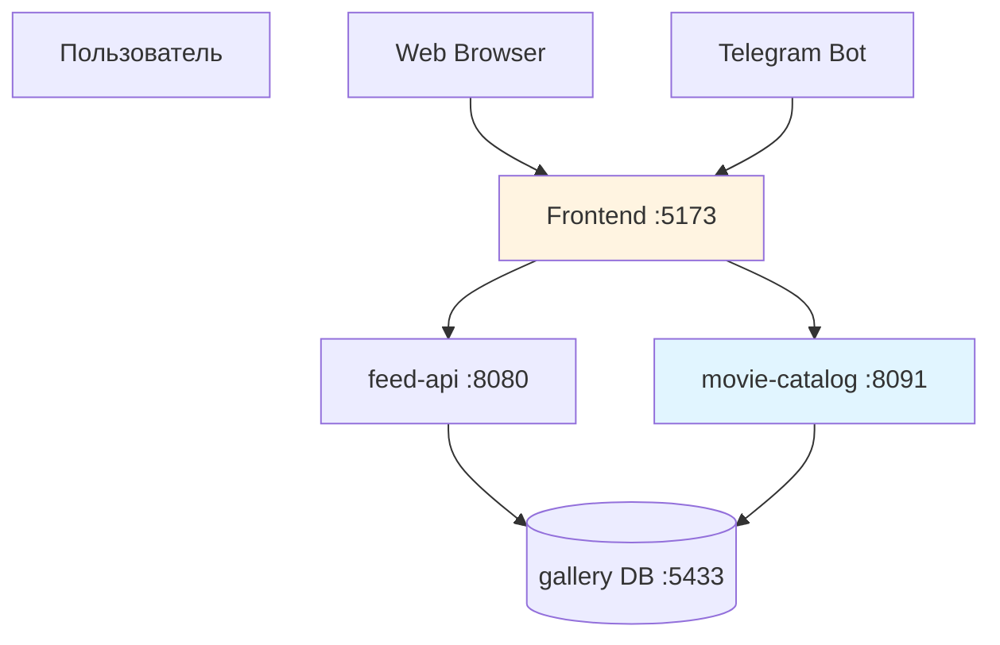
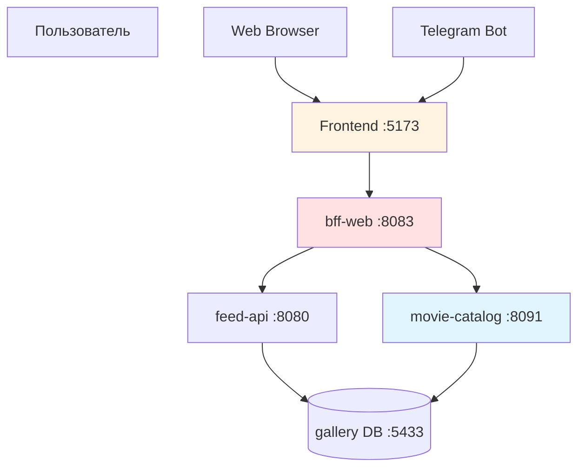

# Аудит интеграции MUDROTOP в проект MUDRO

**Дата**: 2026-03-23  
**Контекст**: Проверка MUDROTOP как микросервиса и его интеграции в сайт MUDRO и Telegram

---

## Исполнительное резюме

MUDROTOP успешно добавлен в проект как **staging-репозиторий** для подготовки каталога фильмов. Микросервис [`movie-catalog`](../services/movie-catalog/README.md) реализован и готов к локальному запуску, но **НЕ интегрирован** в основной runtime MUDRO и Telegram.

### Статус интеграции

| Компонент | Статус | Примечание |
|-----------|--------|------------|
| Микросервис `movie-catalog` | ✅ Реализован | Standalone сервис на порту 8091 |
| Docker compose конфигурация | ✅ Готова | Отдельная конфигурация в [`ops/compose/movie-catalog/`](../ops/compose/movie-catalog/docker-compose.full.local.yml) |
| HTTP API контракт | ✅ Определен | [`contracts/http/movie-catalog-v1.yaml`](../contracts/http/movie-catalog-v1.yaml) |
| Frontend MUDROTOP | ✅ Реализован | Отдельный frontend в [`MUDROTOP/frontend/`](../MUDROTOP/frontend/README.md) |
| Интеграция в основной сайт MUDRO | ❌ Отсутствует | Страница `/movies` - заглушка |
| Интеграция в Telegram bot | ❌ Отсутствует | Нет команд для работы с каталогом |
| Интеграция в BFF-web | ❌ Отсутствует | Нет проксирования запросов |

---

## 1. Структура MUDROTOP как микросервиса

### 1.1 Архитектура

MUDROTOP организован как **mini-mudro staging** с собственной инфраструктурой:

```
MUDROTOP/
├── services/movie-catalog/     # Go HTTP service (порт 8091)
├── frontend/                   # Vite + React + TypeScript UI
├── internal/catalog/           # Domain logic
├── migrations/movie_catalog/   # SQL схема
├── tools/importers/            # Data import CLI
├── ops/compose/                # Docker compose конфигурации
└── docs/                       # Документация
```

**Ключевые компоненты:**

1. **Backend**: [`services/movie-catalog`](../services/movie-catalog/README.md)
   - Read-only HTTP API
   - Postgres на порту 5434 (отдельная БД `movie_catalog`)
   - Endpoints: `/healthz`, `/api/movie-catalog/genres`, `/api/movie-catalog/movies`

2. **Frontend**: [`MUDROTOP/frontend`](../MUDROTOP/frontend/README.md)
   - Standalone Vite приложение
   - Feature-Sliced Design архитектура
   - Фильтры по году, длительности, жанрам
   - Пагинация

3. **Data pipeline**:
   ```
   raw merged.json → prepare script → slim JSON → importer → Postgres → HTTP API → UI
   ```

### 1.2 Оценка качества

**Сильные стороны:**
- ✅ Чистая архитектура с разделением слоев (domain, adapters, http)
- ✅ Типизированный HTTP контракт (OpenAPI 3.1)
- ✅ Отсутствие SQL в HTTP handlers
- ✅ Серверная фильтрация и пагинация
- ✅ Healthcheck endpoint с проверкой БД
- ✅ Graceful shutdown

**Слабые стороны:**
- ⚠️ Нет тестов для repository слоя
- ⚠️ Нет метрик и логирования
- ⚠️ Нет rate limiting
- ⚠️ Нет CORS конфигурации для cross-origin запросов

---

## 2. Интеграция в основной сайт MUDRO

### 2.1 Текущее состояние

**Основной frontend** ([`frontend/src/app/router/index.tsx`](../frontend/src/app/router/index.tsx:22)):
```typescript
{ path: '/movies', element: withSuspense(<MoviesPage />) }
```

**Страница `/movies`** ([`frontend/src/pages/movies-page/ui/MoviesPage.tsx`](../frontend/src/pages/movies-page/ui/MoviesPage.tsx:1)):
```typescript
// Заглушка с текстом "Этот раздел скоро появится"
```

### 2.2 Что отсутствует

1. **API проксирование**: Нет маршрутизации `/api/movie-catalog/*` в основном API
2. **Frontend интеграция**: Код из `MUDROTOP/frontend` не импортирован в основной frontend
3. **BFF агрегация**: [`services/bff-web`](../services/bff-web/app/run.go) не проксирует запросы к movie-catalog
4. **Навигация**: Страница `/movies` не использует компоненты из MUDROTOP

### 2.3 Варианты интеграции

#### Вариант A: Прямая интеграция в основной frontend

**Шаги:**
1. Скопировать компоненты из `MUDROTOP/frontend/src` в `frontend/src`
2. Заменить заглушку [`MoviesPage`](../frontend/src/pages/movies-page/ui/MoviesPage.tsx) на [`MovieCatalogPage`](../MUDROTOP/frontend/src/pages/movie-catalog-page/ui/MovieCatalogPage.tsx)
3. Добавить проксирование `/api/movie-catalog/*` в [`vite.config.ts`](../frontend/vite.config.ts)
4. Запустить `movie-catalog` сервис параллельно с основным API

**Плюсы:**
- Единый frontend bundle
- Нет дублирования UI компонентов
- Простая навигация между разделами

**Минусы:**
- Смешивание кода из двух проектов
- Зависимость от запуска двух backend сервисов

#### Вариант B: Интеграция через BFF-web

**Шаги:**
1. Добавить проксирование в [`services/bff-web`](../services/bff-web/app/run.go):
   ```go
   mux.Handle("/api/bff/web/v1/movies/", 
       httputil.NewSingleHostReverseProxy(movieCatalogURL))
   ```
2. Обновить frontend для использования BFF endpoint
3. Добавить `movie-catalog` в [`ops/compose/docker-compose.services.yml`](../ops/compose/docker-compose.services.yml)

**Плюсы:**
- Единая точка входа для frontend
- Возможность добавить кеширование и агрегацию
- Соответствует микросервисной архитектуре

**Минусы:**
- Дополнительный hop в сети
- Нужно поддерживать BFF слой

#### Вариант C: Iframe/микрофронтенд

**Шаги:**
1. Деплоить MUDROTOP frontend отдельно
2. Встроить через iframe или Web Components

**Плюсы:**
- Полная изоляция
- Независимый деплой

**Минусы:**
- Сложность навигации и state management
- SEO проблемы
- Не рекомендуется для данного случая

### 2.4 Рекомендация

**Вариант A** (прямая интеграция) - оптимальный для текущего этапа:
- MUDROTOP позиционируется как staging для слияния в основной проект
- Код уже следует Feature-Sliced Design
- Минимальные изменения в инфраструктуре

---

## 3. Интеграция в Telegram как опция

### 3.1 Текущее состояние

**Telegram bot** ([`internal/bot/handler.go`](../internal/bot/handler.go)):
- Нет команд для работы с каталогом фильмов
- Нет упоминаний `movie-catalog` или `MUDROTOP`

**Telegram miniapp support** в основном frontend:
- ✅ Реализован [`useTelegramWebApp`](../frontend/src/features/telegram-miniapp/hooks/useTelegramWebApp.ts) hook
- ✅ Определены типы [`telegram-webapp.d.ts`](../frontend/src/features/telegram-miniapp/types/telegram-webapp.d.ts)
- ✅ Проверка `isTelegramMiniApp()`

### 3.2 Варианты интеграции

#### Вариант 1: Telegram Mini App (Web App)

**Концепция**: Открывать MUDROTOP frontend как Telegram Web App

**Шаги:**
1. Добавить команду в bot:
   ```go
   case "/movies":
       webAppURL := "https://mudro.example.com/movies"
       keyboard := tgbotapi.NewInlineKeyboardMarkup(
           tgbotapi.NewInlineKeyboardRow(
               tgbotapi.NewInlineKeyboardButtonWebApp("🎬 Открыть каталог", webAppURL),
           ),
       )
   ```
2. Настроить Web App в BotFather
3. Адаптировать UI для Telegram theme

**Плюсы:**
- Полноценный UI с фильтрами и пагинацией
- Использует существующий frontend
- Нативная интеграция с Telegram

**Минусы:**
- Требует HTTPS
- Ограничения Telegram Web App API

#### Вариант 2: Inline bot команды

**Концепция**: Текстовые команды для поиска фильмов

**Примеры:**
```
/movies search драма
/movies year 2020
/movies genre комедия
```

**Плюсы:**
- Работает без Web App
- Быстрый доступ через команды

**Минусы:**
- Ограниченный UX
- Сложно реализовать фильтры
- Много кода для парсинга команд

#### Вариант 3: Inline query

**Концепция**: Использовать inline режим бота

```
@mudro_bot фильм драма 2020
```

**Плюсы:**
- Можно использовать в любом чате
- Красивые карточки фильмов

**Минусы:**
- Нужно настроить inline mode
- Ограничения на количество результатов

### 3.3 Рекомендация

**Вариант 1** (Telegram Mini App) - наиболее подходящий:
- Переиспользует существующий UI
- Лучший UX для каталога с фильтрами
- Соответствует современным практикам Telegram

**Дополнительно**: Добавить команду `/movies` с кнопкой для открытия Mini App

---

## 4. Docker Compose конфигурации

### 4.1 Существующие конфигурации

**MUDROTOP standalone** ([`MUDROTOP/ops/compose/docker-compose.full.local.yml`](../MUDROTOP/ops/compose/docker-compose.full.local.yml)):
```yaml
services:
  postgres:      # порт 5434, БД movie_catalog
  movie-catalog: # порт 8091
  frontend:      # порт 5173 (nginx)
```

**Основной проект** ([`ops/compose/docker-compose.core.yml`](../ops/compose/docker-compose.core.yml)):
```yaml
services:
  db:       # порт 5433, БД gallery
  redis:    # порт 6379
  kafka:    # порт 9092
  api:      # порт 8080
  agent:    # worker/planner
```

**Дублирование** в [`ops/compose/movie-catalog/`](../ops/compose/movie-catalog/docker-compose.full.local.yml):
- Копия конфигурации из MUDROTOP
- Не используется в основном runtime

### 4.2 Проблемы

1. **Изоляция**: movie-catalog не включен в core runtime
2. **Дублирование**: Две копии docker-compose конфигураций
3. **Порты**: Отдельная БД на 5434 вместо использования основной на 5433
4. **Нет в services.yml**: Не добавлен в микросервисный слой

### 4.3 Рекомендации

**Интеграция в core runtime:**

```yaml
# ops/compose/docker-compose.core.yml
services:
  # ... существующие сервисы
  
  movie-catalog:
    build:
      context: ../..
      dockerfile: services/movie-catalog/Dockerfile
    environment:
      MOVIE_CATALOG_ADDR: ":8091"
      MOVIE_CATALOG_DB_DSN: postgres://postgres:postgres@db:5432/gallery?sslmode=disable
    depends_on:
      db:
        condition: service_healthy
    ports:
      - "127.0.0.1:8091:8091"
```

**Преимущества:**
- Единая БД (можно использовать отдельную схему `movie_catalog`)
- Запуск через `make core-up`
- Интеграция с основным runtime

---

## 5. API Endpoints и контракты

### 5.1 Контракт movie-catalog

**OpenAPI спецификация**: [`contracts/http/movie-catalog-v1.yaml`](../contracts/http/movie-catalog-v1.yaml)

**Endpoints:**

| Метод | Path | Описание |
|-------|------|----------|
| GET | `/healthz` | Health check с проверкой БД |
| GET | `/api/movie-catalog/genres` | Список жанров для фильтров |
| GET | `/api/movie-catalog/movies` | Фильтрованный список фильмов |

**Query параметры `/movies`:**
- `year_min` (integer) - минимальный год
- `duration_min` (integer) - минимальная длительность в минутах
- `include_genre` (string) - обязательный жанр
- `exclude_genres` (array) - исключаемые жанры
- `page` (integer, min: 1) - номер страницы
- `page_size` (integer, min: 1, max: 100) - размер страницы

**Response `/movies`:**
```json
{
  "items": [
    {
      "id": "string",
      "name": "string",
      "alternative_name": "string",
      "year": 2020,
      "duration": 120,
      "rating": 8.5,
      "poster_url": "string",
      "description": "string",
      "kp_url": "string",
      "genres": ["драма", "триллер"]
    }
  ],
  "total": 1500,
  "page": 1,
  "page_size": 12
}
```

### 5.2 Качество контракта

**Сильные стороны:**
- ✅ Полная типизация (OpenAPI 3.1)
- ✅ Валидация параметров (min/max)
- ✅ Документированные error responses
- ✅ Pagination support

**Улучшения:**
- ⚠️ Добавить примеры запросов/ответов
- ⚠️ Документировать rate limits
- ⚠️ Добавить CORS headers в спецификацию

### 5.3 Интеграция с основным API

**Текущее состояние**: Нет проксирования в основном API ([`internal/api/server.go`](../internal/api/server.go))

**Варианты:**

1. **Прямое проксирование в feed-api**:
   ```go
   // internal/api/server.go
   movieCatalogURL, _ := url.Parse("http://movie-catalog:8091")
   movieProxy := httputil.NewSingleHostReverseProxy(movieCatalogURL)
   
   mux.Handle("/api/movie-catalog/", http.StripPrefix("/api/movie-catalog", movieProxy))
   ```

2. **Через BFF-web** (рекомендуется):
   ```go
   // services/bff-web/app/run.go
   mux.Handle("/api/bff/web/v1/movies/", movieCatalogProxy)
   ```

---

## 6. Frontend интеграция

### 6.1 Архитектура MUDROTOP frontend

**Структура** ([`MUDROTOP/frontend/src`](../MUDROTOP/frontend/src)):
```
src/
├── pages/movie-catalog-page/    # Orchestration page
├── widgets/movie-catalog/       # Grid, states, pagination
├── features/movie-filters/      # Draft/apply/reset filters
├── entities/movie/              # API, types, domain logic
└── shared/                      # UI kit, utils
```

**Соответствие Feature-Sliced Design**: ✅ Полное

### 6.2 Основной frontend

**Текущая страница** ([`frontend/src/pages/movies-page/ui/MoviesPage.tsx`](../frontend/src/pages/movies-page/ui/MoviesPage.tsx)):
```typescript
// Заглушка с иконкой и текстом
<Film className="text-slate-300 mb-4" size={48} />
<h2>Фильмы</h2>
<p>Этот раздел скоро появится</p>
```

### 6.3 План интеграции

**Шаг 1**: Копировать entities и features
```bash
cp -r MUDROTOP/frontend/src/entities/movie frontend/src/entities/
cp -r MUDROTOP/frontend/src/features/movie-filters frontend/src/features/
cp -r MUDROTOP/frontend/src/widgets/movie-catalog frontend/src/widgets/
```

**Шаг 2**: Обновить MoviesPage
```typescript
// frontend/src/pages/movies-page/ui/MoviesPage.tsx
import { MovieCatalogPage } from '@/pages/movie-catalog-page/ui/MovieCatalogPage'

const MoviesPage = () => {
  return <MovieCatalogPage />
}
```

**Шаг 3**: Настроить API proxy
```typescript
// frontend/vite.config.ts
export default defineConfig({
  server: {
    proxy: {
      '/api/movie-catalog': {
        target: 'http://127.0.0.1:8091',
        changeOrigin: true,
      },
    },
  },
})
```

**Шаг 4**: Обновить env конфигурацию
```typescript
// frontend/src/shared/config/env.ts
export const env = {
  apiBaseUrl: import.meta.env.VITE_API_BASE_URL || '/api',
  movieCatalogApiUrl: import.meta.env.VITE_MOVIE_CATALOG_API_URL || '/api/movie-catalog',
}
```

### 6.4 Telegram miniapp адаптация

**Существующая инфраструктура**:
- ✅ [`useTelegramWebApp`](../frontend/src/features/telegram-miniapp/hooks/useTelegramWebApp.ts) hook
- ✅ Theme detection (`colorScheme`, `themeParams`)
- ✅ `webApp.ready()` и `webApp.expand()` вызовы

**Необходимые изменения для movie-catalog**:

```typescript
// frontend/src/pages/movies-page/ui/MoviesPage.tsx
import { useTelegramWebApp } from '@/features/telegram-miniapp/hooks/useTelegramWebApp'

const MoviesPage = () => {
  const { isTelegram, themeParams } = useTelegramWebApp()
  
  return (
    <div style={isTelegram ? { 
      backgroundColor: themeParams?.bg_color,
      color: themeParams?.text_color 
    } : undefined}>
      <MovieCatalogPage />
    </div>
  )
}
```

---

## 7. Выводы и рекомендации

### 7.1 Текущий статус

**MUDROTOP реализован как:**
- ✅ Standalone микросервис с чистой архитектурой
- ✅ Отдельный frontend с современным стеком
- ✅ Типизированный HTTP контракт
- ✅ Docker compose конфигурация для локальной разработки

**НЕ интегрирован:**
- ❌ В основной сайт MUDRO (страница `/movies` - заглушка)
- ❌ В Telegram bot (нет команд)
- ❌ В core runtime (отдельная инфраструктура)
- ❌ В BFF-web (нет проксирования)

### 7.2 Критические задачи для интеграции

#### Приоритет 1: Интеграция в основной сайт

1. **Скопировать frontend компоненты** из MUDROTOP в основной проект
2. **Заменить заглушку** [`MoviesPage`](../frontend/src/pages/movies-page/ui/MoviesPage.tsx) на [`MovieCatalogPage`](../MUDROTOP/frontend/src/pages/movie-catalog-page/ui/MovieCatalogPage.tsx)
3. **Добавить API proxy** в [`vite.config.ts`](../frontend/vite.config.ts)
4. **Включить movie-catalog** в [`ops/compose/docker-compose.core.yml`](../ops/compose/docker-compose.core.yml)
5. **Обновить документацию** в [`README.md`](../README.md)

#### Приоритет 2: Интеграция в Telegram

1. **Добавить команду `/movies`** в [`internal/bot/handler.go`](../internal/bot/handler.go)
2. **Настроить Web App** в BotFather
3. **Адаптировать UI** для Telegram theme (уже есть инфраструктура)
4. **Добавить deep linking** для прямого открытия каталога

#### Приоритет 3: Production готовность

1. **Добавить метрики** (Prometheus)
2. **Настроить логирование** (structured logging)
3. **Добавить rate limiting**
4. **Настроить CORS** для cross-origin запросов
5. **Написать тесты** для repository слоя
6. **Добавить CI/CD** pipeline

### 7.3 Архитектурные решения

**Рекомендуемая архитектура интеграции:**



**Альтернатива с BFF:**



### 7.4 Риски и митигация

| Риск | Вероятность | Влияние | Митигация |
|------|-------------|---------|-----------|
| Конфликт зависимостей при слиянии frontend | Средняя | Низкое | Использовать одинаковые версии React/Vite |
| Производительность при большом каталоге | Низкая | Среднее | Индексы в БД, кеширование |
| CORS проблемы в production | Средняя | Среднее | Настроить CORS middleware |
| Telegram Web App ограничения | Низкая | Низкое | Fallback на inline режим |

### 7.5 Следующие шаги

**Немедленно (1-2 дня):**
1. Интегрировать frontend компоненты в основной проект
2. Добавить movie-catalog в core docker-compose
3. Обновить документацию

**Краткосрочно (1 неделя):**
1. Добавить команду `/movies` в Telegram bot
2. Настроить Telegram Mini App
3. Добавить метрики и логирование

**Среднесрочно (2-4 недели):**
1. Написать тесты
2. Настроить CI/CD
3. Production deployment
4. Мониторинг и алерты

---

## 8. Заключение

MUDROTOP представляет собой качественно реализованный микросервис с современной архитектурой. Код готов к интеграции в основной проект MUDRO, но требует выполнения интеграционных задач.

**Ключевые достижения:**
- Чистая архитектура с разделением слоев
- Типизированный HTTP контракт
- Серверная фильтрация и пагинация
- Feature-Sliced Design в frontend

**Основные пробелы:**
- Отсутствие интеграции в основной сайт
- Нет команд в Telegram bot
- Изолированная инфраструктура

**Рекомендация**: Приступить к интеграции по плану выше, начиная с frontend компонентов и docker-compose конфигурации.
